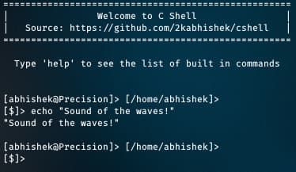

<div align = "center">

<h1><a href="https://2kabhishek.github.io/cshell">cshell</a></h1>

<a href="https://github.com/2KAbhishek/cshell/blob/main/LICENSE">
 </a>

<a href="https://github.com/2KAbhishek/cshell/graphs/contributors">
 </a>

<a href="https://github.com/2KAbhishek/cshell/stargazers">
</a>

<a href="https://github.com/2KAbhishek/cshell/network/members">
 </a>

<a href="https://github.com/2KAbhishek/cshell/watchers">
 </a>

<a href="https://github.com/2KAbhishek/cshell/pulse">
 </a>

<h3>Not a seashell ⛵🐚</h3>

<figure>
  
  <br/>
  <figcaption>cshell screenshot</figcaption>
</figure>

</div>

## What is this

cshell is an alternative to the standard sh shell written entirely in c and all in a single file within ~500 LOC.

It supports pipes, redirections, history, and more. Comes with a customized prompt.

## Inspiration

Most Operating Systems classes have a project for creating a shell. I never got to around to do that.
This is my shot at creating my own shell.

## Prerequisites

Before you begin, ensure you have met the following requirements:

- You have installed the latest version of `gcc, make`

## Getting cshell

To install cshell, follow these steps:

```bash
git clone https://github.com/2kabhishek/cshell
cd cshell
make cshell
```

## Using cshell

You can link the cshell executable to your $PATH or just run it from the command line.

```bash
./cshell
```

This will start the shell and display the a help message along with the prompt.
You can use it like any other shell.

## How it was built

cshell was built using `c`

## Challenges faced

- Struggled somewhat in the begining to handle signals, but eventually got it working.

## What I learned

- Learned a lot about `c` and it's different syscalls.
- Understood the internal workings pipes and redirections.

## What's next

Clean up the code and make it more readable, add more features, and make it more robust.

Hit the ⭐ button if you found this useful.

## More Info

<div align="center">

<a href="https://github.com/2KAbhishek/cshell">Source</a> | <a href="https://2kabhishek.github.io/cshell">Website</a>

</div>
